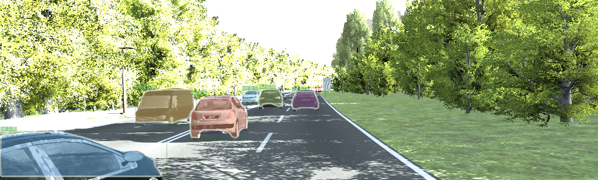

# detectronRoot
This repository contains a forked implementation of the Detectron library by Facebook AI Research (FAIR). The forked Mask RCNN is built to provide results as required by the KITTI evaluation script. 

The images seen below have been obtained from the [Virtual KITTI](http://www.europe.naverlabs.com/Research/Computer-Vision/Proxy-Virtual-Worlds) dataset. 
<div align="center">
  
  <p>Example Mask R-CNN output on V-KITTI sequence 0018. </p>
</div>
A modification was made to the detectron code to provide a mask of each detected object along with the pred_list file which contains their class and confidence. This is useful when we want to evaluate the results using the KITTI evaluation script. 
<div align="center">
  
  <p>Example Mask given for object 001 of input image.</p>
</div>

## Installation Instructions
There are a few things to know before you can run the model. 
1. In your home directory, run the following code:

```
mkdir detectronRoot
mkdir DetectronModelWts
cd detectronRoot/ 
git clone https://github.com/sidpethe/detectronHelperScripts.git
```

2. Next, download the detectron pretrained weights file for [End to End Faster & Mask RCNN 2x](https://dl.fbaipublicfiles.com/detectron/35861858/12_2017_baselines/e2e_mask_rcnn_R-101-FPN_2x.yaml.02_32_51.SgT4y1cO/output/train/coco_2014_train:coco_2014_valminusminival/generalized_rcnn/model_final.pkl). 

3. Place this file in the folder ~/DetectronModelWts and rename it to *e2e_mask_rcnn_R-101-FPN_2x.pkl*

4. For Detectron installation instructions, look at [Installing Detectron](https://github.com/facebookresearch/Detectron/blob/master/INSTALL.md)


## Scripts

### runme 
This is used to test the Mask RCNN network on a store of images in the specified input directory. 

Changes can be made to variables based on your implementation.

### clean
This file is used to prepare the output folder (runFolder) for the next set of images.

NOTE: Make sure you copy the results you need *BEFORE* you run this file.

## Author
Sid Pethe is a recent graduate from the Australian National University after completing a Master of Engineering(Mechatronics). 

The work shown here was undertaken in the course of a Research Project at the Australian Centre for Robotic Vision(ACRV) and The Australian National University.

## Acknowledgements
This work was primarily done in collaboration with PhD candidates from the ARC Australian Centre for Robotic Vision and The Australian National University. 

Special Thanks to Mina Henein, PhD Candidate, ACRV and Prof. Viorela Ila.
